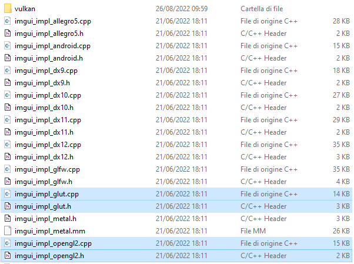

# Tutorial: how to use ImGui with GLUT

<p  align="center">
  
</p>

[Dear ImGui](https://github.com/ocornut/imgui) is a graphical user interface library for C++. It is fast, portable, renderer agnostic and self-contained (no external dependencies).
It is designed to enable fast iterations and to empower programmers to create content creation tools and visualization / debug tools (as opposed to UI for the average end-user).

## Installing the library

ImGui doesn't require any build process, you just have to download .h and .cpp files and add them to your project.

### Download the library

You can clone the ImGui repository using this command:
```
git clone https://github.com/ocornut/imgui.git
```

If you want all the latest features you can clone the docking branch instead:
```
git clone -b docking https://github.com/ocornut/imgui.git
```

All the files you need are already there, you can find the core files in the root folder and the backends in the "backends" folder. To use ImGui with GLUT you have to take:
- imgui_impl_glut.h
- imgui_impl_glut.cpp
- imgui_impl_opengl2.h
- imgui_impl_opengl2.cpp

<p align="center">
  
  
</p>

### Use the library inside your VS project
Now that you have all the files you need you can open your Visual Studio project and edit the following properties (be sure to edit properties of the right configuration).

Add the path to the folder containing ImGui's .h files inside the "Additional include directories" setting under the "C/C++" section of the properties.

<p align="center">
  
</p>

Add ImGui's .cpp files to your project's source files. If you're using glut instead of freeglut you have to change line 36 of "imgui_impl_glut.cpp" from:
```c++
#include <GL/freeglut.h>
```
to:
```c++
#include <GL/glut.h>
```

Now you can copy and run the [HelloWorld](#imgui-with-glut-backend-helloworld) script from ImGui to check that everything is working correctly.

## Usage
The [HelloWorld](#imgui-with-glut-backend-helloworld) example shows how to use some basic features of the library, there's also a demo window where you can find a lot of more advanced stuff. The source code for the demo window is inside the "imgui_demo.cpp" file, there you can find out how everything inside the demo window is done.

If you're working on a game-like application you'll probably need to have buttons and other stuff directly on the screen instead of having windows around, here's how to create a fullscreen invisible window that you can then populate with your UI.
```c++

```

If you downloaded the docking branch of ImGui you can also have docking enabled in your fullscreen window.
```c++

```

If you want to use Combos or Lists you may need to do that with vectors, for that you can implement a wrapper function like this:
```c++

```

### Integration with GLUT
As you have seen before ImGui has a backend for its usage with GLUT, so you don't need to do anything special to combine it with a GLUT based application. The HelloWorld example below shows everything you need for basic usage.

Note that if you need to use other custom GLUT callbacks you have to replace:
```c++
ImGui_ImplGLUT_InstallFuncs();
```
with the usual glutXXXFunc passing your custom callback, then inside your callback you have to call ImGui_ImplGLUT_XXX. You can see how to do that in the [ImGui for game-like applications](#imgui-for-game-like-applications) example.

## Examples
### ImGui with GLUT backend HelloWorld
```c++
// Dear ImGui: standalone example application for GLUT/FreeGLUT + OpenGL2, using legacy fixed pipeline
// If you are new to Dear ImGui, read documentation from the docs/ folder + read the top of imgui.cpp.
// Read online: https://github.com/ocornut/imgui/tree/master/docs

// !!! GLUT/FreeGLUT IS OBSOLETE PREHISTORIC SOFTWARE. Using GLUT is not recommended unless you really miss the 90's. !!!
// !!! If someone or something is teaching you GLUT today, you are being abused. Please show some resistance. !!!
// !!! Nowadays, prefer using GLFW or SDL instead!

// On Windows, you can install Freeglut using vcpkg:
//   git clone https://github.com/Microsoft/vcpkg
//   cd vcpkg
//   bootstrap - vcpkg.bat
//   vcpkg install freeglut --triplet=x86-windows   ; for win32
//   vcpkg install freeglut --triplet=x64-windows   ; for win64
//   vcpkg integrate install                        ; register include and libs in Visual Studio
#include <windows.h>
#include "imgui.h"
#include "imgui_impl_glut.h"
#include "imgui_impl_opengl2.h"
#include <GL/glut.h>

#ifdef _MSC_VER
#pragma warning (disable: 4505) // unreferenced local function has been removed
#endif

// Our state
static bool show_demo_window = true;
static bool show_another_window = false;
static ImVec4 clear_color = ImVec4(0.45f, 0.55f, 0.60f, 1.00f);

void my_display_code()
{
    // 1. Show the big demo window (Most of the sample code is in ImGui::ShowDemoWindow()! You can browse its code to learn more about Dear ImGui!).
    if (show_demo_window)
        ImGui::ShowDemoWindow(&show_demo_window);

    // 2. Show a simple window that we create ourselves. We use a Begin/End pair to created a named window.
    {
        static float f = 0.0f;
        static int counter = 0;

        ImGui::Begin("Hello, world!");                          // Create a window called "Hello, world!" and append into it.

        ImGui::Text("This is some useful text.");               // Display some text (you can use a format strings too)
        ImGui::Checkbox("Demo Window", &show_demo_window);      // Edit bools storing our window open/close state
        ImGui::Checkbox("Another Window", &show_another_window);

        ImGui::SliderFloat("float", &f, 0.0f, 1.0f);            // Edit 1 float using a slider from 0.0f to 1.0f
        ImGui::ColorEdit3("clear color", (float*)&clear_color); // Edit 3 floats representing a color

        if (ImGui::Button("Button"))                            // Buttons return true when clicked (most widgets return true when edited/activated)
            counter++;
        ImGui::SameLine();
        ImGui::Text("counter = %d", counter);

        ImGui::Text("Application average %.3f ms/frame (%.1f FPS)", 1000.0f / ImGui::GetIO().Framerate, ImGui::GetIO().Framerate);
        ImGui::End();
    }

    // 3. Show another simple window.
    if (show_another_window)
    {
        ImGui::Begin("Another Window", &show_another_window);   // Pass a pointer to our bool variable (the window will have a closing button that will clear the bool when clicked)
        ImGui::Text("Hello from another window!");
        if (ImGui::Button("Close Me"))
            show_another_window = false;
        ImGui::End();
    }
}

void glut_display_func()
{
    // Start the Dear ImGui frame
    ImGui_ImplOpenGL2_NewFrame();
    ImGui_ImplGLUT_NewFrame();

    my_display_code();

    // Rendering
    ImGui::Render();
    ImGuiIO& io = ImGui::GetIO();
    glViewport(0, 0, (GLsizei)io.DisplaySize.x, (GLsizei)io.DisplaySize.y);
    glClearColor(clear_color.x * clear_color.w, clear_color.y * clear_color.w, clear_color.z * clear_color.w, clear_color.w);
    glClear(GL_COLOR_BUFFER_BIT);
    //glUseProgram(0); // You may want this if using this code in an OpenGL 3+ context where shaders may be bound, but prefer using the GL3+ code.
    ImGui_ImplOpenGL2_RenderDrawData(ImGui::GetDrawData());

    glutSwapBuffers();
    glutPostRedisplay();
}

// You can read the io.WantCaptureMouse, io.WantCaptureKeyboard flags to tell if dear imgui wants to use your inputs.
// - When io.WantCaptureMouse is true, do not dispatch mouse input data to your main application, or clear/overwrite your copy of the mouse data.
// - When io.WantCaptureKeyboard is true, do not dispatch keyboard input data to your main application, or clear/overwrite your copy of the keyboard data.
// Generally you may always pass all inputs to dear imgui, and hide them from your application based on those two flags.

int main(int argc, char** argv)
{
    // Create GLUT window
    glutInit(&argc, argv);
#ifdef __FREEGLUT_EXT_H__
    glutSetOption(GLUT_ACTION_ON_WINDOW_CLOSE, GLUT_ACTION_GLUTMAINLOOP_RETURNS);
#endif
    glutInitDisplayMode(GLUT_RGBA | GLUT_DOUBLE | GLUT_MULTISAMPLE);
    glutInitWindowSize(1280, 720);
    glutCreateWindow("Dear ImGui GLUT+OpenGL2 Example");

    // Setup GLUT display function
    // We will also call ImGui_ImplGLUT_InstallFuncs() to get all the other functions installed for us,
    // otherwise it is possible to install our own functions and call the imgui_impl_glut.h functions ourselves.
    glutDisplayFunc(glut_display_func);

    // Setup Dear ImGui context
    IMGUI_CHECKVERSION();
    ImGui::CreateContext();
    ImGuiIO& io = ImGui::GetIO(); (void)io;
    //io.ConfigFlags |= ImGuiConfigFlags_NavEnableKeyboard;     // Enable Keyboard Controls

    // Setup Dear ImGui style
    ImGui::StyleColorsDark();
    //ImGui::StyleColorsClassic();

    // Setup Platform/Renderer backends
    // FIXME: Consider reworking this example to install our own GLUT funcs + forward calls ImGui_ImplGLUT_XXX ones, instead of using ImGui_ImplGLUT_InstallFuncs().
    ImGui_ImplGLUT_Init();
    ImGui_ImplGLUT_InstallFuncs();
    ImGui_ImplOpenGL2_Init();

    // Load Fonts
    // - If no fonts are loaded, dear imgui will use the default font. You can also load multiple fonts and use ImGui::PushFont()/PopFont() to select them.
    // - AddFontFromFileTTF() will return the ImFont* so you can store it if you need to select the font among multiple.
    // - If the file cannot be loaded, the function will return NULL. Please handle those errors in your application (e.g. use an assertion, or display an error and quit).
    // - The fonts will be rasterized at a given size (w/ oversampling) and stored into a texture when calling ImFontAtlas::Build()/GetTexDataAsXXXX(), which ImGui_ImplXXXX_NewFrame below will call.
    // - Read 'docs/FONTS.md' for more instructions and details.
    // - Remember that in C/C++ if you want to include a backslash \ in a string literal you need to write a double backslash \\ !
    //io.Fonts->AddFontDefault();
    //io.Fonts->AddFontFromFileTTF("../../misc/fonts/Roboto-Medium.ttf", 16.0f);
    //io.Fonts->AddFontFromFileTTF("../../misc/fonts/Cousine-Regular.ttf", 15.0f);
    //io.Fonts->AddFontFromFileTTF("../../misc/fonts/DroidSans.ttf", 16.0f);
    //io.Fonts->AddFontFromFileTTF("../../misc/fonts/ProggyTiny.ttf", 10.0f);
    //ImFont* font = io.Fonts->AddFontFromFileTTF("c:\\Windows\\Fonts\\ArialUni.ttf", 18.0f, NULL, io.Fonts->GetGlyphRangesJapanese());
    //IM_ASSERT(font != NULL);

    glutMainLoop();

    // Cleanup
    ImGui_ImplOpenGL2_Shutdown();
    ImGui_ImplGLUT_Shutdown();
    ImGui::DestroyContext();

    return 0;
}
```

### ImGui for game-like applications
```c++

```
