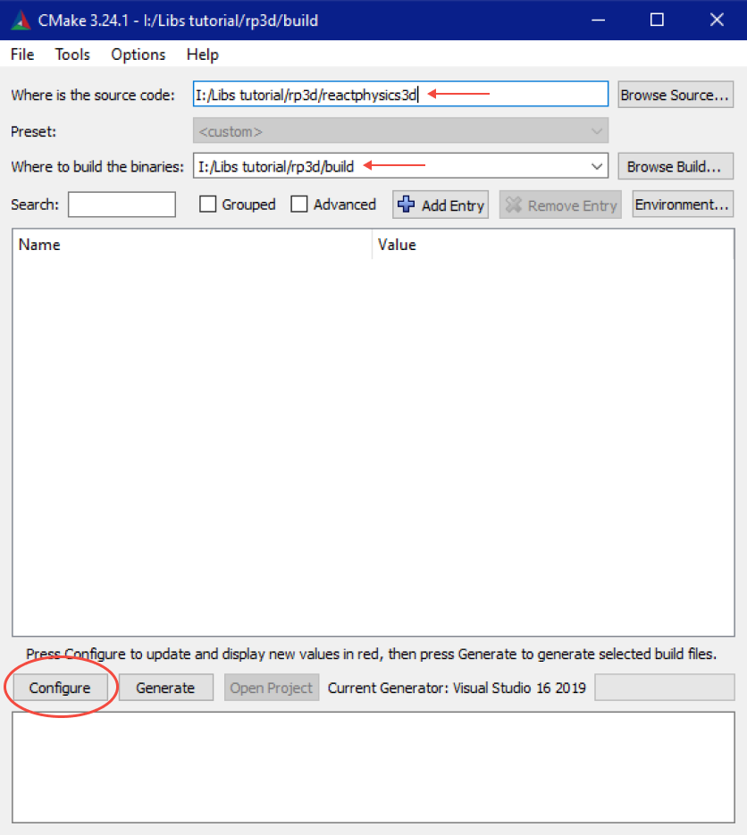
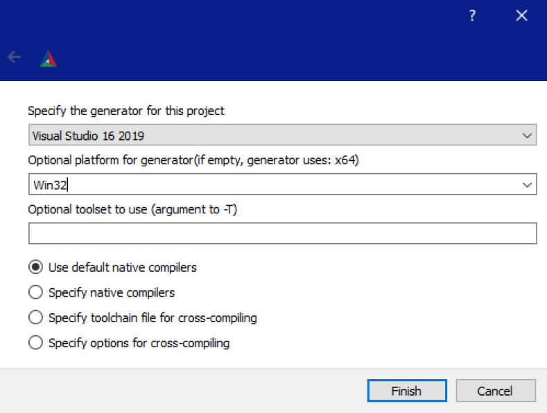
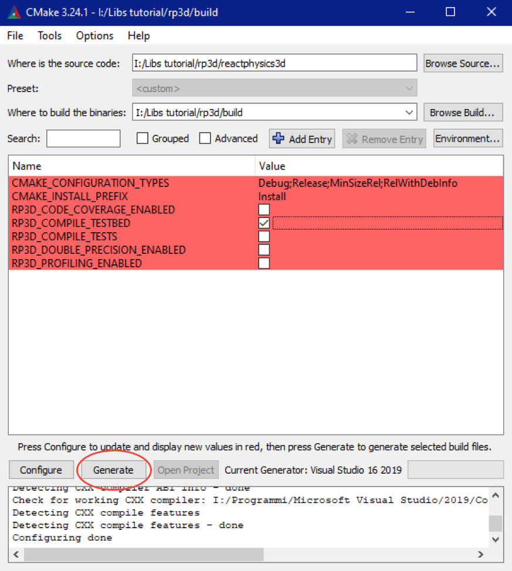
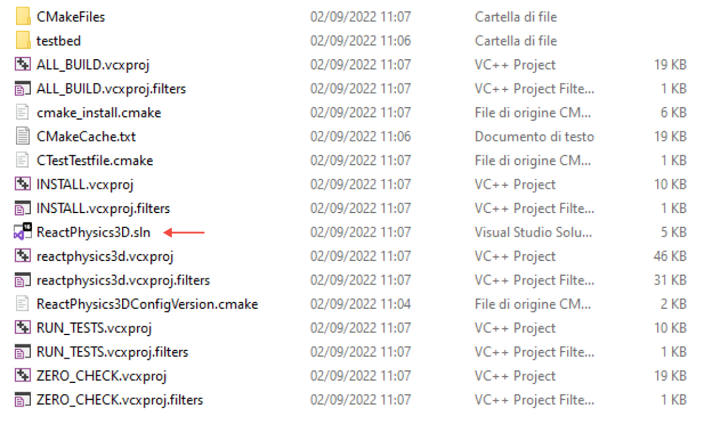
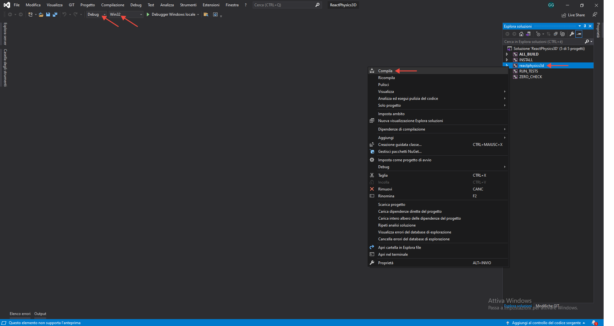
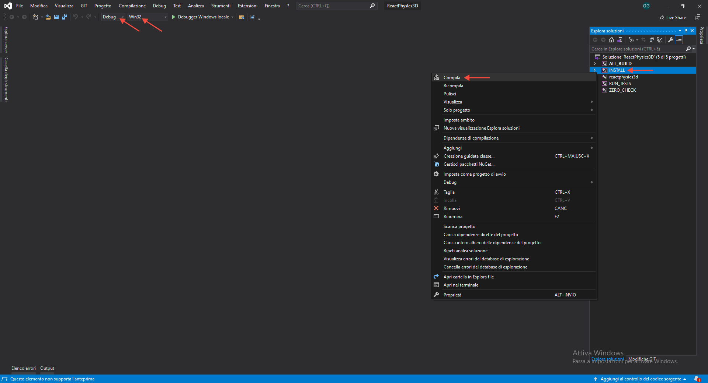
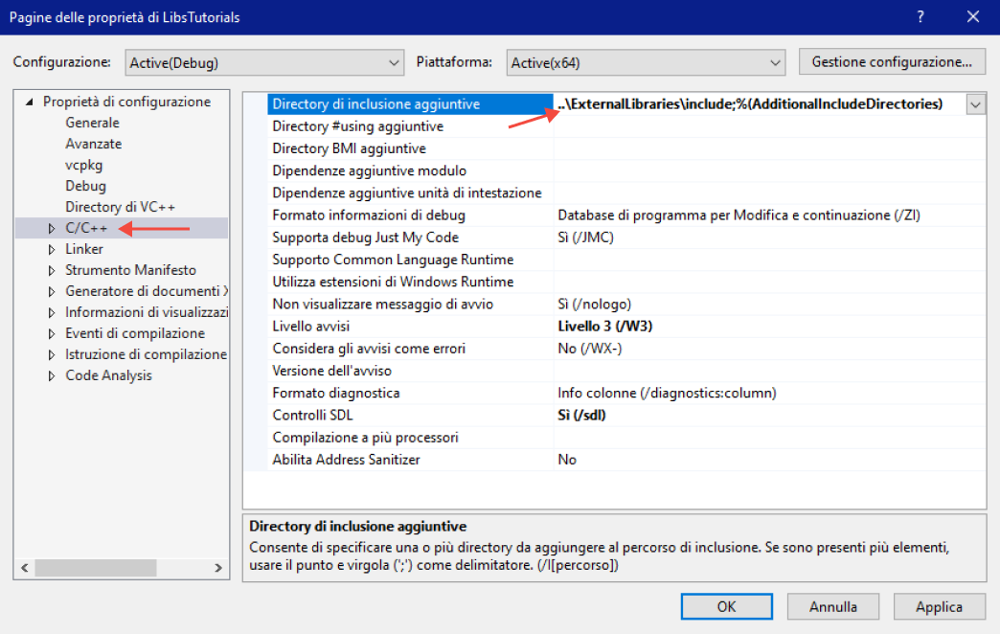
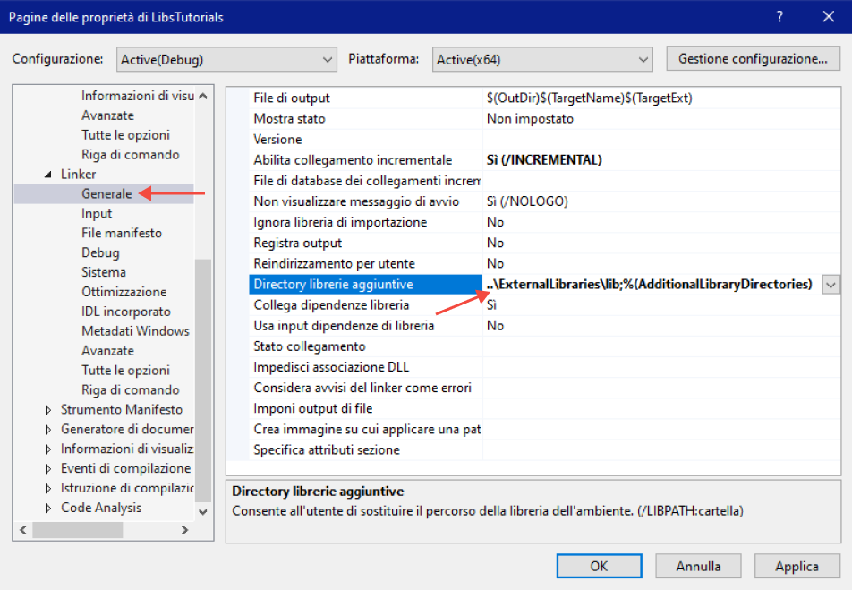
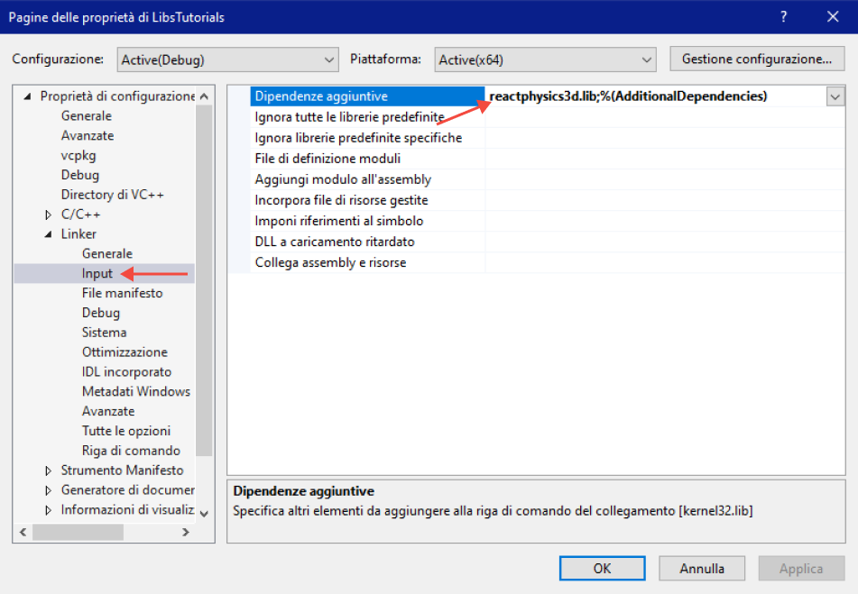
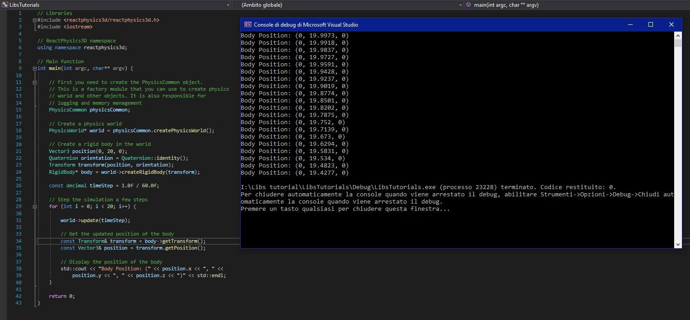

# Tutorial: usare ReactPhysics3D con GLUT
ReactPhysics3D is an open source C++ physics engine library that can be used in 3D simulations and games.
https://www.reactphysics3d.com/
https://github.com/DanielChappuis/reactphysics3d
https://www.reactphysics3d.com/documentation.html

## Installazione
Per ultreiori dettagli https://www.reactphysics3d.com/usermanual

### Scarica la libreria precompilata
[link]
Scarica i file e passa direttamente alla sezione [link]

### Compila manualmente la libreria
Usa il seguente comando per scaricare la repository di ReactPhysics3D.
```
git clone https://github.com/DanielChappuis/reactphysics3d.git
```

Se non hai cmake installato sul pc scaricalo ed installalo https://cmake.org/download/

Apri cmake gui
Inserisci il percorso della cartella in cui è stata clonata la repository ed un percorso per una cartella di output, poi clicca configure.

<p  align="center">
  
</p>

Seleziona il generator che vuoi utilizzare e la piattaforma con cui vuoi che sia compilata la libreria.

<p  align="center">
  
</p>

Cambia impostazioni se necessario, da qui puoi decidere la cartella di output che sarà usata in fase di installazione e se compilare anche la testbed application in cui sono presenti vari esempi di utilizzo di cui puoi esplorare il codice [link alla sezione del manuale].
Clicca generate

<p  align="center">
  
</p>

Apri la soluzione di vs nella cartella di output

<p  align="center">
  
</p>

Scegli modalità di compilazione in modo che coincida con quelle del progetto e verifica che la piattaforma sia quella scelta allo step x.
Tasto destro su reactphysics3d -> compila

<p  align="center">
  
</p>

Poi tasto destro su install -> compila

<p  align="center">
  
</p>

Nella cartella di output che avevi impostato con cmake troverai i file da portare nel tuo progetto

### Aggiungi la libreria al progetto VS
Dopo aver ottenuto i file della libreria è necessario modificare le proprietà del progetto in questo modo:

Aggiungi il percorso alla cartella include di ReactPhysics3D in additional include directories

<p  align="center">
  
</p>

Aggiungi il percorso alla cartella lib di ReactPhysics3D in additional lib directories

<p  align="center">
  
</p>

Aggiungi il nome del file lib alle dipendenze aggiuntive

<p  align="center">
  
</p>

A questo punto puoi provare ad eseguire l'helloworld[link] per verificare il funzionamento

<p  align="center">
  
</p>

## Utilizzo
intro

### Integrazione con glut

<p  align="center">
  
</p>

## Esempi
### ReactPhysics3D HelloWorld
```c++
// Libraries 
#include <reactphysics3d/reactphysics3d.h> 
#include <iostream> 
 
// ReactPhysics3D namespace 
using namespace reactphysics3d; 
 
// Main function 
int main(int argc, char** argv) { 
 
    // First you need to create the PhysicsCommon object. 
    // This is a factory module that you can use to create physics 
    // world and other objects. It is also responsible for 
    // logging and memory management 
    PhysicsCommon physicsCommon; 
 
    // Create a physics world 
    PhysicsWorld* world = physicsCommon.createPhysicsWorld(); 
 
    // Create a rigid body in the world 
    Vector3 position(0, 20, 0); 
    Quaternion orientation = Quaternion::identity(); 
    Transform transform(position, orientation); 
    RigidBody* body = world->createRigidBody(transform); 
 
    const decimal timeStep = 1.0f / 60.0f; 
 
    // Step the simulation a few steps 
    for (int i=0; i < 20; i++) { 
 
        world->update(timeStep); 
 
        // Get the updated position of the body 
        const Transform& transform = body->getTransform(); 
        const Vector3& position = transform.getPosition(); 
 
        // Display the position of the body 
        std::cout << "Body Position: (" << position.x << ", " << 
      position.y << ", " << position.z << ")" << std::endl; 
    } 
 
    return 0; 
}
```

### Integrazione di ReactPhysics3D con GLUT
```c++
/* 
	Example of ReactPhysics3D integration with GLUT
 */

#include <reactphysics3d/reactphysics3d.h>
#include <windows.h>
#include <GL/glut.h>
#include <stdlib.h>
#include <iostream>

#define PI 3.141592654
#define DegToRad(deg) (deg * PI / 180)

#define XRES 800
#define YRES 800
float Vx_min = -1.0, Vx_max = 1.0;
float Vy_min = -1.0, Vy_max = 1.0;

bool simulate = true;

// Materials
GLfloat mat_solid_cyan[] = {0.2, 0.6, 0.6, 1.0};
GLfloat mat_solid_dark[] = {0.1, 0.1, 0.1, 1.0};
GLfloat mat_emission_zero[] = {0.0, 0.0, 0.0, 1.0};

// Lights
GLfloat light_ambient[] = {0.0, 0.0, 0.0, 1.0};
GLfloat light_diffuse[] = {1.0, 1.0, 1.0, 1.0};
GLfloat light_position[] = {0.0, 0.0, 12.0, 0.0};
GLfloat light_lmodel_amb[] = {0.4, 0.4, 0.4, 1.0};
GLfloat light_local_view[] = {0.0};

// Physics
using namespace rp3d;

PhysicsCommon physicsCommon;
PhysicsWorld *world = physicsCommon.createPhysicsWorld();
const decimal timeStep = 1.0f / 60.0f;

// Cube
Vector3 cubeSize(0.5, 0.5, 0.5);
Vector3 cubeInitPosition(0, 0.5, 0);
Quaternion cubeInitOrientation = Quaternion::fromEulerAngles(DegToRad(10), DegToRad(30), 0);
RigidBody *cubeBody;

// Floor
Vector3 floorSize(5, 0.4, 2);
Vector3 floorInitPosition(0, -0.8, 0);
Quaternion floorInitOrientation = Quaternion::identity();
RigidBody *floorBody;

void init(void)
{
	glClearColor(0.95, 0.95, 0.95, 0.0);
	glClear(GL_COLOR_BUFFER_BIT);	

	// Init lighting
	glEnable(GL_DEPTH_TEST);
	glLightfv(GL_LIGHT0, GL_AMBIENT, light_ambient);
	glLightfv(GL_LIGHT0, GL_DIFFUSE, light_diffuse);
	glLightfv(GL_LIGHT0, GL_POSITION, light_position);
	glLightModelfv(GL_LIGHT_MODEL_AMBIENT, light_lmodel_amb);
	glLightModelfv(GL_LIGHT_MODEL_LOCAL_VIEWER, light_local_view);
	glEnable(GL_LIGHTING);
	glEnable(GL_LIGHT0);

	// Init physics objects
	// Cube
	Transform cubeTransform(cubeInitPosition, cubeInitOrientation);				// Define initial transform of the object
	cubeBody = world->createRigidBody(cubeTransform);							// Create rigidbody

	BoxShape *cubeShape = physicsCommon.createBoxShape(cubeSize * 0.5);			// Create collider shape
	cubeBody->addCollider(cubeShape, rp3d::Transform::identity());				// Add collider to rigidbody
	cubeBody->setMass(0.8);
	cubeBody->getCollider(0)->getMaterial().setBounciness(0.4);

	// Floor
	Transform floorTransform(floorInitPosition, floorInitOrientation);			// Define initial transform of the object
	floorBody = world->createRigidBody(floorTransform);							// Create rigidbody

	BoxShape *floorShape = physicsCommon.createBoxShape(floorSize * 0.5);		// Create collider shape
	floorBody->addCollider(floorShape, rp3d::Transform::identity());			// Add collider to rigidbody

	floorBody->setType(BodyType::STATIC);										// Set floor rigidbody type to static
}

void drawBoxFromRigidBody(Vector3 boxSize, RigidBody *boxBody, GLfloat matColor[4])
{
	glMaterialfv(GL_FRONT, GL_DIFFUSE, matColor);

	glPushMatrix();
	glLoadIdentity();

	float boxHTM[16];
	Transform boxTransform = boxBody->getTransform();		// Get current rigidbody transform
	boxTransform.getOpenGLMatrix(boxHTM);					// Get homogeneus transformation matrix from transform
	glMultMatrixf(boxHTM);									// Multiply the matrix to move and rotate the object

	glScalef(boxSize.x, boxSize.y, boxSize.z);				// Draw a generic box scaling a cube
	glutSolidCube(1);

	glPopMatrix();
}

void display(void)
{
	glClear(GL_COLOR_BUFFER_BIT | GL_DEPTH_BUFFER_BIT);	
	glMaterialfv(GL_FRONT, GL_EMISSION, mat_emission_zero);

	drawBoxFromRigidBody(cubeSize, cubeBody, mat_solid_cyan);		// Draw cube
	drawBoxFromRigidBody(floorSize, floorBody, mat_solid_dark);		// Draw floor

	glutSwapBuffers();
}

void idle(void)
{
	if (simulate)
	{
		world->update(timeStep);		// Update physics world
		glutPostRedisplay();
	}
}

void myReshape(GLsizei w, GLsizei h)
{
	glViewport(0, 0, (GLsizei)w, (GLsizei)h);
	glMatrixMode(GL_PROJECTION);
	glLoadIdentity();
	glOrtho(Vx_min, Vx_max, Vy_min, Vy_max, -1.0, 1.0);
	glMatrixMode(GL_MODELVIEW);
}

void keyboard(unsigned char key, int x, int y)
{
	switch (key) {
	case 27: // ESC
		exit(1);
		break;
	case 32: // SPACEBAR
		simulate = !simulate;
	default:
		break;
	}
}

int main(int argc, char **argv)
{
	glutInit(&argc, argv);
	glutInitDisplayMode(GLUT_DOUBLE | GLUT_RGB);
	glutInitWindowSize(XRES, YRES);
	glutCreateWindow("Example rp3d + glut");

	init();

	glutDisplayFunc(display);
	glutReshapeFunc(myReshape);
	glutIdleFunc(idle);
	glutKeyboardFunc(keyboard);
	glutMainLoop();
	return 0;
}
```
